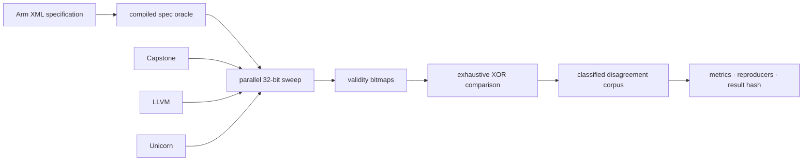

<div align="center">

# SILICA

**A complete map of where AArch64 decoders disagree with the architecture.**

Silica walks every one of the 4,294,967,296 possible A64 instruction words,
compares Capstone, LLVM, and Unicorn with Arm's machine-readable specification,
and turns the differences into reproducible evidence.

[](Cargo.toml)
[](pyproject.toml)
[](LICENSE)
[](verification metadata)
[](docs/formats.md)

</div>

---

A disassembler saying “valid” is easy. Knowing whether it is right is harder.
Most differential testing can reveal that tools disagree, but it cannot identify
the correct answer without an independent oracle. Silica uses Arm's XML release
as that oracle.

A64 makes an unusually thorough experiment possible: instructions are exactly
32 bits wide, so the entire encoding space is finite and practical to enumerate.
Silica takes advantage of that property. The validity results below are not an
estimate or a fuzzing campaign; every possible word was checked.

## What Silica found

These results use `ISA_A64_xml_A_profile-2026-06_mc` (Armv9.6-A). The sweep was
split into 256 independently verified shards covering all 2³² encodings.

| Result | Count | Share of the full space |
|---|---:|---:|
| Allocated by the Arm specification | 1,799,435,776 | 41.9% |
| Unallocated by the Arm specification | 2,495,531,520 | 58.1% |
| Validity disagreements found | 723,801,678 | 16.9% |
| Minimal upstream-ready reproducers | 10 | — |

Agreement with the specification on whether an encoding is valid:

| Decoder | Agreement | Visual |
|---|---:|---|
| Capstone | 84.8% | `█████████████████████████░░░░░` |
| LLVM | 87.6% | `██████████████████████████░░░░` |
| Unicorn | 88.3% | `██████████████████████████░░░░` |

The large validity gap has identifiable causes. Unicorn tests validity by
executing an instruction and observing traps, while the other oracles decode
without execution. A small number of regions are also affected by decode-time
`UNDEFINED` conditions that the compiled specification oracle does not evaluate.
Silica records these limitations instead of smoothing them out of the result.

### Instruction text

Comparing rendered mnemonics and operands is much more expensive than recording
a validity bit. Silica therefore evaluates text on a deterministic sample of
1,000,000 words drawn from 1,266,064,016 candidates where all four oracles
consider the encoding valid. This is a sampled result and is deliberately kept
separate from the exhaustive validity figures.

| Classification within the sample | Records | Share |
|---|---:|---:|
| Operand rendering differs | 862,648 | 86.3% |
| Normalization needs review | 137,352 | 13.7% |

The sample is useful for locating normalization and presentation work; it does
not claim exhaustive coverage of every textual rendering.

## How it works



The high-volume path is written in Rust and calls each decoder in-process. It
stores one bit per encoding per oracle, which keeps the exhaustive comparison
compact and makes disagreement a direct bitmap operation. Crashes are bisected
to the exact instruction word.

Python handles specification compilation, normalization, reporting, and the
independent verification layer. Artifact schemas, sampling rules, and known
limitations are documented in [docs/formats.md](docs/formats.md).

## Reproducing the work

Create the pinned environment and check that the required local inputs are
available:

```bash
micromamba create -y -p ./.venv -f environment.yml
micromamba run -p ./.venv silica doctor
```

Arm's XML specification is not vendored because of its license. `silica doctor`
reports where Silica expects to find it and any other missing prerequisites.

To run the full pipeline from a prepared checkout:

```bash
make all
```

This is a full 2³² sweep, not a quick smoke test. It produces the compiled
oracle, shard records, validity bitmaps, disagreement corpus, published metrics,
reproducers, and a stable SHA-256 result hash.

## Trust, but verify

Seven independent verifiers recompute the project's claims from raw artifacts.
They do not trust a generated summary, and each verifier has a fixture proving
that it detects the defect it guards against. There is no skipped or provisional
state.

```bash
micromamba run -p ./.venv silica verify
```

Pinned decoder versions and a freshly recomputed result hash make separate runs
comparable. The verification goals and their current status are recorded in
[verification metadata](verification metadata).

## Scope

Silica currently covers base A64 and Advanced SIMD decoding. SVE, SVE2, SME,
A32/T32, RISC-V, assembler round trips, and general execution testing are outside
the v1 study.

The closest inspiration is [Sandsifter](https://github.com/trailofbits/sandsifter),
which explores x86's variable-length instruction space. Silica applies the same
spirit of systematic skepticism to AArch64, where fixed-width encodings and an
independent specification allow a complete, adjudicated comparison.

---

<div align="center">

Apache 2.0 — see [LICENSE](LICENSE)

</div>
