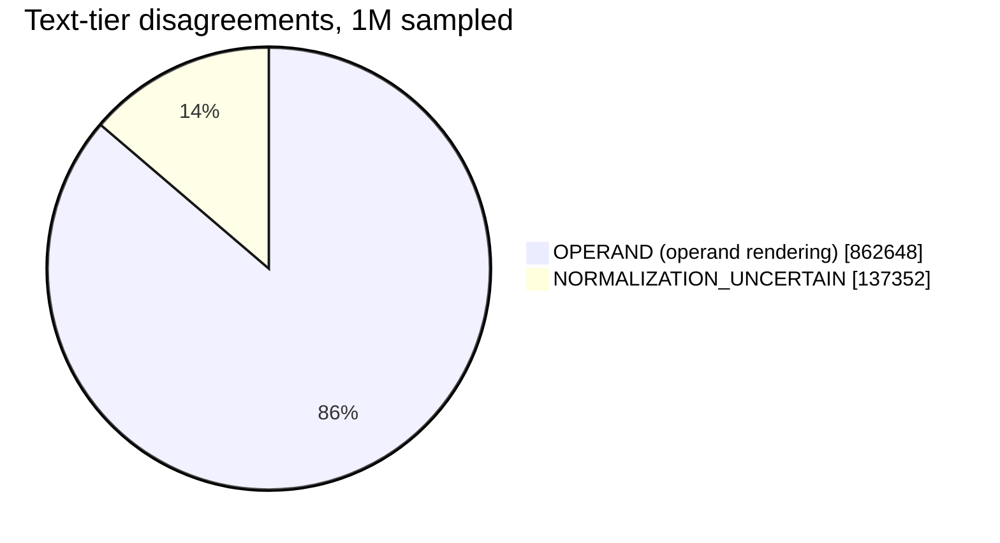
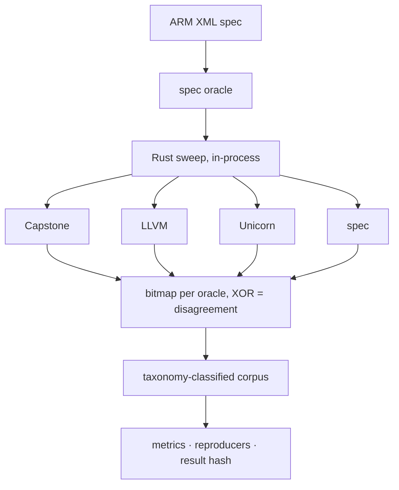

<div align="center">

# SILICA

**Exhaustive differential validation of the AArch64 instruction decode space.**

All 4,294,967,296 A64 encodings, decoded through Capstone/LLVM/Unicorn,
diffed against ARM's machine-readable spec. Not sampled — all of it.

[](Cargo.toml)
[](pyproject.toml)
[](LICENSE)
[](GOALS.yml)
[](docs/formats.md)

</div>

---

Unlike [Sandsifter](https://github.com/trailofbits/sandsifter) on x86 —
variable-length encoding forces sampling, and no independent ground truth
means it can only show disagreement, never who's right — A64's fixed 32-bit
width makes the space enumerable, and ARM's XML spec is real ground truth.
So this doesn't sample: every encoding, every tool, diffed against spec.

## Results

Measured against `ISA_A64_xml_A_profile-2026-06_mc` (Armv9.6-A), 256
independently-verified shards, all 2³² encodings.

| | |
|---|---|
| Allocated / unallocated per spec | 1,799,435,776 / 2,495,531,520 (41.9% / 58.1%) |
| Total disagreements | 724,801,678 (16.9% of the space) |
| Reproducers extracted | 10 |

| Tool | Validity (exhaustive) | | Text (1M sample) |
|---|---|---|---|
| Capstone | 84.8% | `█████████████████████████░░░░░` | 99.9% |
| LLVM | 87.6% | `██████████████████████████░░░░` | 99.9% |
| Unicorn | 88.3% | `██████████████████████████░░░░` | 99.9% |



Bulk of `VALIDITY` disagreement is two known effects, not noise: Unicorn's
execution-based validity (traps on run) vs. the three decode-based oracles,
and unevaluated decode-time `UNDEFINED` conditions in a few shards.

## Pipeline



Rust: in-process C API links, no subprocess per encoding, crash bisection
to the exact word. Python: spec compile, normalization, metrics.

## Verification

7 independent verifiers, each recomputing from raw artifacts (not trusting
a summary), each with a fixture proving it catches its defect. No skip
state.

```bash
micromamba run -p ./.venv silica verify
```

Pinned tool versions, one-command pipeline (`make all`), SHA-256 result
hash recomputed fresh on every run.

## Running

```bash
micromamba create -y -p ./.venv -f environment.yml
micromamba run -p ./.venv silica doctor
make check
```

ARM's XML spec isn't vendored (license); `silica doctor` checks for it.

## Scope

v1: base A64 + Advanced SIMD, decode-only. Out: SVE/SVE2/SME, A32/T32,
RISC-V, assembler round-trip, execution testing.

---

<div align="center">

Apache 2.0 — see [LICENSE](LICENSE)

</div>
