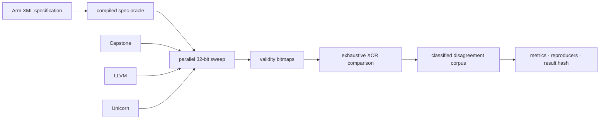

<div align="center">

# SILICA

**An exhaustive comparison of A64 instruction-allocation decisions.**

Silica checks every one of the 4,294,967,296 possible A64 instruction words.
It compares whether Capstone, LLVM, Unicorn, and a table compiled from Arm's
XML encoding diagrams accept each word.

[](Cargo.toml)
[](pyproject.toml)
[](https://pypi.org/project/silica-scope/)
[](LICENSE)
[](docs/formats.md)

</div>

---

A decoder and an encoding diagram do not answer exactly the same question.
Capstone and LLVM decode instructions, Unicorn attempts execution, and Silica's
XML-derived table matches the fixed bits in Arm's encoding diagrams. Comparing
them is useful, but a mismatch is not automatically a decoder bug.

A64 instructions are 32 bits wide, so the allocation comparison can cover the
entire input space. The validity counts below are exhaustive for the pinned
versions and configuration. The instruction-text analysis is sampled.

## Results at a glance

These artifacts use `ISA_A64_xml_A_profile-2026-06_mc` and 256 shards covering
all 2³² words.

| XML-derived allocation result | Count | Share |
|---|---:|---:|
| Matches an in-scope encoding pattern | 1,799,435,776 | 41.9% |
| Matches no in-scope encoding pattern | 2,495,531,520 | 58.1% |

Across the four validity bitmaps, 723,801,678 words have at least one differing
classification. This is 16.9% of the full word space. It is a disagreement
count, not a count of confirmed bugs.

Pairwise agreement with the XML-derived allocation bitmap:

| Tool | Agreement |
|---|---:|
| Capstone | 84.8% |
| LLVM | 87.6% |
| Unicorn | 88.3% |

These percentages do not rank decoder correctness. In particular, the compiled
XML table does not evaluate instruction pseudocode, feature availability, or
every decode-time constraint. Unicorn also answers through execution and traps
rather than through disassembly. Each difference needs instruction-family and
configuration analysis before it can support an upstream bug report.

### Instruction text

Comparing rendered mnemonics and operands is much more expensive than recording
a validity bit. Silica therefore evaluates text on a deterministic sample of
1,000,000 words drawn from 1,266,064,016 candidates where all four oracles
consider the encoding valid. This is a sampled result and is deliberately kept
separate from the exhaustive validity figures.

| Classification within the sample | Records | Share |
|---|---:|---:|
| Operand rendering differs | 862,648 | 86.3% |
| Normalization needs review | 137,352 | 13.7% |

The sample is useful for locating normalization and presentation work; it does
not claim exhaustive coverage of every textual rendering.

## Explore the results

The sweep engine produces a large research dataset. **[silica-scope](https://pypi.org/project/silica-scope/)**
is the companion terminal app for making that dataset approachable. It opens a
finished Silica artifact directory and lets you browse headline metrics, inspect
the 256-shard encoding map, filter disagreements, look up any 32-bit word, and
read the filing-ready reproducers.

Install it from PyPI with Python 3.11 or newer:

```bash
pipx install silica-scope
```

Then run it from a Silica checkout or point it at an artifact directory:

```bash
silica-scope
silica-scope /path/to/silica/artifacts
silica-scope --report
```

`silica-scope` is a pure-Python reader with no native decoder dependencies. It
does not launch the exhaustive sweep, and it handles the repository's smaller
published artifact set gracefully. See the [terminal reader guide](tui/README.md)
for the panes, keyboard controls, and artifact discovery options.

## How it works



The high-volume path is written in Rust and calls each decoder in-process. It
stores one bit per encoding per oracle, which keeps the exhaustive comparison
compact and makes disagreement a direct bitmap operation. Crashes are bisected
to the exact instruction word.

Python handles specification compilation, normalization, reporting, and the
independent verification layer. Artifact schemas, sampling rules, and known
limitations are documented in [docs/formats.md](docs/formats.md).

## Reproducing the work

Create the pinned environment and check that the required local inputs are
available:

```bash
micromamba create -y -p ./.venv -f environment.yml
micromamba run -p ./.venv silica doctor
```

Arm's XML specification is not vendored because of its license. `silica doctor`
reports where Silica expects to find it and any other missing prerequisites.

To run the full pipeline from a prepared checkout:

```bash
make all
```

This is a full 2³² sweep, not a quick smoke test. It produces the compiled
oracle, shard records, validity bitmaps, disagreement corpus, published metrics,
reproducers, and a stable SHA-256 result hash.

## Trust, but verify

Seven independent verifiers recompute the project's claims from raw artifacts.
They do not trust a generated summary, and each verifier has a fixture proving
that it detects the defect it guards against. There is no skipped or provisional
state.

```bash
micromamba run -p ./.venv silica verify
```

Pinned decoder versions and a freshly recomputed result hash make separate runs
comparable.

## Scope

Silica currently covers base A64 and Advanced SIMD decoding. SVE, SVE2, SME,
A32/T32, RISC-V, assembler round trips, and general execution testing are outside
the v1 study.

The closest inspiration is [Sandsifter](https://github.com/Battelle/sandsifter),
which explores x86's variable-length instruction space. Silica applies the same
spirit of systematic skepticism to AArch64, where fixed-width encodings and an
independent specification allow a complete, adjudicated comparison.

---

<div align="center">

Apache 2.0 — see [LICENSE](LICENSE)

</div>
