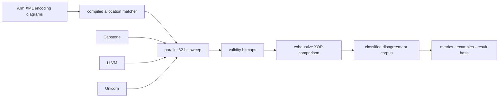

<div align="center">

# SILICA

**An exhaustive comparison of A64 instruction-allocation decisions.**

Silica checks every one of the 4,294,967,296 possible A64 instruction words.
It compares whether Capstone, LLVM, Unicorn, and a table compiled from Arm's
XML encoding diagrams accept each word.

[](Cargo.toml)
[](pyproject.toml)
[](https://pypi.org/project/silica-scope/)
[](LICENSE)
[](docs/formats.md)

</div>

---

A decoder and an encoding diagram do not answer exactly the same question.
Capstone and LLVM decode instructions, Unicorn attempts execution, and Silica's
XML-derived table matches the fixed bits in Arm's encoding diagrams. Comparing
them is useful, but a mismatch is not automatically a decoder bug.

A64 instructions are 32 bits wide, so the allocation comparison can cover the
entire input space. The validity counts below are exhaustive for the pinned
versions and configuration. The instruction-text analysis is sampled.

## Results at a glance

These artifacts use `ISA_A64_xml_A_profile-2026-06_mc` and 256 shards covering
all 2³² words.

| XML-derived allocation result | Count | Share |
|---|---:|---:|
| Matches an in-scope encoding pattern | 1,799,435,776 | 41.9% |
| Matches no in-scope encoding pattern | 2,495,531,520 | 58.1% |

Across the four validity bitmaps, 723,801,678 words have at least one differing
classification. This is 16.9% of the full word space. It is a disagreement
count, not a count of confirmed bugs.

Pairwise agreement with the XML-derived allocation bitmap:

| Tool | Agreement |
|---|---:|
| Capstone | 84.8% |
| LLVM | 87.6% |
| Unicorn | 88.3% |

These percentages do not rank decoder correctness. In particular, the compiled
XML table does not evaluate instruction pseudocode, feature availability, or
every decode-time constraint. Unicorn also answers through execution and traps
rather than through disassembly. Each difference needs instruction-family and
configuration analysis before it can support an upstream bug report.

### Instruction text is diagnostic only

Silica recorded a deterministic sample of 1,000,000 words from the
1,266,064,016 words accepted by all four validity checks. The outputs are not
symmetrical: Capstone and LLVM return complete disassembly text, the XML table
returns only a mnemonic, and Unicorn returns the placeholder `<valid>`.

The current classifier reports:

| Classification | Records | Share |
|---|---:|---:|
| Same normalized mnemonic, different full text | 862,648 | 86.3% |
| Different normalized mnemonic | 137,352 | 13.7% |

The 86.3% value is not an operand-error rate. In most records, a full
instruction is being compared with a mnemonic-only reference. Alias handling
also remains conservative when an XML alias condition cannot be proven from
rendered text. These records are leads for analysis, not findings about decoder
correctness.

### What the ten examples mean

The files in [`artifacts/reproducers`](artifacts/reproducers) are ten distinct
records selected from the first five eligible disagreement shards. Selection
prefers text categories and caps repeated `(category, spec mnemonic)` pairs.
All ten current files compare Capstone with the XML-derived mnemonic.

They prove that the records exist in the generated corpus and can be reproduced
from one instruction word. They have not been independently adjudicated as ten
Capstone bugs, and they are not evidence that LLVM and Unicorn agree on the
rendered instruction. Three are explicitly marked `NORMALIZATION_UNCERTAIN`.
The generator and verifier are
[`g6_reproducers.py`](pysilica/analyze/g6_reproducers.py) and
[`verify/g6_reproducers.py`](pysilica/verify/g6_reproducers.py).

## Explore the results

The sweep produces a large dataset. **[silica-scope](https://pypi.org/project/silica-scope/)**
is its terminal reader. It opens a Silica artifact directory, shows the metrics
and 256-shard map, filters disagreement records, and looks up individual words.
It can also open the ten example records with their stated limitations.

Install it from PyPI with Python 3.11 or newer:

```bash
pipx install silica-scope
```

Then run it from a Silica checkout or point it at an artifact directory:

```bash
silica-scope
silica-scope /path/to/silica/artifacts
silica-scope --report
```

`silica-scope` is a pure-Python reader. It does not run the sweep or require the
native decoder libraries. See the [terminal reader guide](tui/README.md) for
keyboard controls and artifact discovery.

## How it works



The high-volume path is written in Rust and calls each decoder in-process. It
stores one bit per encoding per oracle, which keeps the exhaustive comparison
compact and makes disagreement a direct bitmap operation. Crashes are bisected
to the exact instruction word.

Python handles XML compilation, normalization, reporting, and verification.
Artifact schemas and sampling rules are documented in
[docs/formats.md](docs/formats.md). The source of each headline value is:

| Claim | Artifact | Recomputed by |
|---|---|---|
| XML allocation count | `artifacts/g1_metrics.json` | G1 |
| Exhaustive validity differences | four validity bitmaps | G2 and G5 |
| Sample category counts | `artifacts/g4_metrics.json` | G4 |
| Pairwise agreement percentages | `artifacts/report/metrics.json` | G5 |
| Ten selected example records | `artifacts/reproducers/*.md` | G6 |
| Published artifact digest | `artifacts/result_hash.txt` | G7 |

## Reproducing the work

Create the pinned environment and check that the required local inputs are
available:

```bash
micromamba create -y -p ./.venv -f environment.yml
micromamba run -p ./.venv silica doctor
```

Arm's XML specification is not vendored because of its license. `silica doctor`
reports where Silica expects to find it and any other missing prerequisites.

The checked-in artifacts can be inspected without rerunning the sweep:

```bash
silica-scope artifacts
```

The `make all` recipe lists the stages for a fresh run, but it is not currently
a turnkey reproduction command. Its G4 handoff still requires converting the
reservoir JSON into a word list, and three corpus totals are passed as explicit
arguments. The Makefile calls out that gap directly. A fresh publication run
should not be represented as reproduced until that handoff is automated and
the totals flow from generated output.

## Verification

The `silica verify` command runs seven repository-owned gates. They check XML
compilation metadata, shard coverage, normalization evidence, corpus structure,
published metrics, example records, and the artifact hash. Calling them gates
is deliberate: they provide consistency checks, but they are not independent
implementations or external confirmation of decoder bugs.

```bash
micromamba run -p ./.venv silica verify
```

G4 and G5 stream the large disagreement corpus and validity bitmaps, so this is
not a quick documentation check. Run it before publishing or changing numeric
claims. For ordinary README edits, review the cited JSON artifacts and defer the
full verifier until the change is ready for publication.

## Scope

The XML matcher includes base A64 and Advanced SIMD encoding patterns after the
compiler's scope filter. It excludes SVE, SVE2, SME, and other classes listed in
`artifacts/g1_metrics.json`. A32/T32, RISC-V, assembler round trips, semantic
equivalence, and general execution correctness are outside this study.

The closest inspiration is [Sandsifter](https://github.com/Battelle/sandsifter),
which explores x86's variable-length instruction space. Silica focuses on the
finite A64 word space and publishes the raw classifications needed for later
family-by-family adjudication.

---

<div align="center">

Apache 2.0 — see [LICENSE](LICENSE)

</div>
